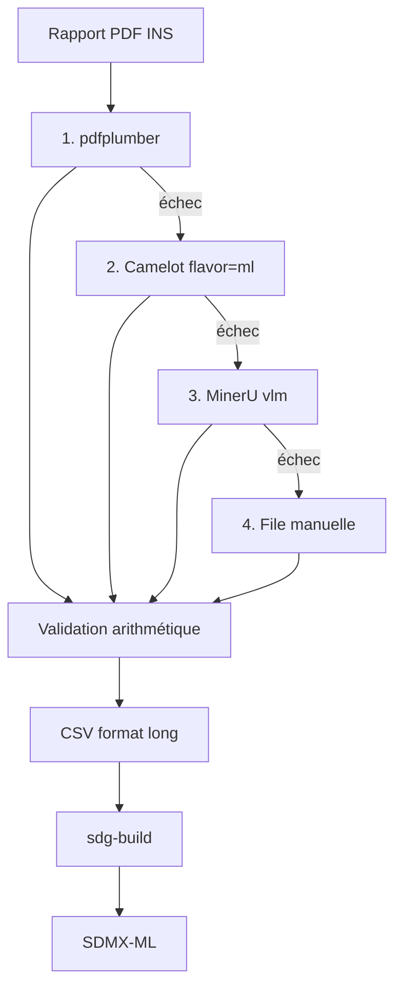

# Projet INS Niger → SDMX — document de reprise

**Version :** 8 septembre 2026
**Statut :** exploration terminée, exécution non commencée
**Destinataire :** l'utilisateur (Ak, Niamey) et tout assistant reprenant le dossier

---

# PARTIE 0 — INSTRUCTIONS DE REPRISE (à lire en premier)

## 0.1 Avertissement

Ce document a été construit au fil d'une longue conversation exploratoire. **Plusieurs affirmations initiales se sont révélées fausses après vérification.** Elles sont consignées en Partie 3 pour ne pas être reproduites.

## 0.2 Règles pour l'assistant qui reprend

1. **Ne jamais affirmer une nouveauté sans l'avoir cherchée.** Ce dossier a produit au moins quatre erreurs de ce type. Chaque fois qu'une phrase de la forme « personne ne fait X » apparaît, elle doit être vérifiée par recherche avant d'être servie à l'utilisateur.
2. **Distinguer trois statuts** dans toute réponse : `VÉRIFIÉ` (source citée), `NON VÉRIFIÉ` (hypothèse), `RÉFUTÉ` (testé et faux).
3. **Les questions ouvertes de la Partie 4 sont bloquantes.** Ne pas planifier de développement sur une branche dont la question amont n'est pas tranchée.
4. **L'utilisateur pousse au recadrage et a raison de le faire.** Il a corrigé plusieurs emballements. Ne pas survendre.
5. **Contrainte de calendrier absolue :** World Bank YPP, clôture 30 septembre 2026. Aucun développement long avant cette date.

## 0.3 Vérifications à refaire avant de continuer

| #  | À vérifier                                        | Pourquoi                                                        | Statut                           |
| -- | --------------------------------------------------- | --------------------------------------------------------------- | -------------------------------- |
| V1 | Scores ODIN du Niger**par catégorie**        | Décide si la claim centrale survit, et désigne le cas de test | **EN ATTENTE — BLOQUANT** |
| V2 | Structure des tableaux dans 3 rapports INS espacés | Décide 2 semaines vs 6                                         | Non fait                         |
| V3 | Date d'ouverture du cycle YPP BAD 2027              | Sources contradictoires                                         | Non fait                         |
| V4 | Existence d'un papier complet d'Abdellaoui          | Rien trouvé au 8/09/2026                                       | Non trouvé                      |

---

# PARTIE 1 — OBJECTIF

## 1.1 Le projet

Convertir les publications statistiques PDF des instituts nationaux africains en données tabulaires validées, exploitables par machine, et compatibles SDMX.

**L'outil est générique.** Il traite toute publication PDF à structure répétée dans le temps : annuaire statistique, tableau de bord social, bulletin emploi, rapports sectoriels, campagne agricole.

**Choix du premier cas de test :** prendre la publication de l'INS Niger dont la série est la plus longue et la structure la plus régulière. À déterminer à l'étape 0 (Partie 7), pas décidé d'avance. Critère : nombre de millésimes disponibles × régularité apparente du format.

## 1.2 Ce que l'utilisateur vise

- Un artefact public montrable (dépôt + démo)
- Un contact à la BAD
- Un appui pour les candidatures (World Bank YPP, AfDB YPP, Chevening)

**Pas** un papier académique à ce stade. **Pas** un engagement de maintenance à long terme.

## 1.3 Position assumée de l'utilisateur

> « L'alimentation et le suivi, c'est à l'INS que ça revient. Moi je veux juste que mon système marche. »

Conséquence de conception : **le système doit être repris facilement, pas durer seul.** Documentation du schéma d'entrée, dates affichées partout, README qui dit explicitement qu'aucune mise à jour n'est garantie.

---

# PARTIE 2 — FAITS VÉRIFIÉS

## 2.1 SDMX

| Élément | Fait                                                                          | Source               |
| --------- | ----------------------------------------------------------------------------- | -------------------- |
| Nature    | Norme ISO 17369                                                               | sdmx.org             |
| Parrains  | BRI, BCE, Eurostat, OIT, FMI, OCDE, Division statistique ONU, Banque mondiale | sdmx.org             |
| Versions  | 2.1 (mai 2011), 3.0 (approuvée 2019, spécifications publiées sept. 2021)   | sdmx.org/standards-2 |
| Formats   | SDMX-ML, SDMX-JSON, SDMX-CSV                                                  | idem                 |
| Renommage | SDMX → SDMx                                                                  | idem                 |

**Briques :** DSD (schéma : dimensions, attributs, mesure) · Codelists (vocabulaires contrôlés) · Dataflow (jeu conforme à une DSD).

## 2.2 ODP 2.0 et Africa Information Highway

| Élément        | Fait                                                                                    |
| ---------------- | --------------------------------------------------------------------------------------- |
| ODP              | Plateforme de diffusion en nuage, développée par la BAD avec apport du FMI            |
| Déploiement     | INS, banques centrales et ministères des 54 pays                                       |
| AIH              | 54 pays + 16 organisations régionales                                                  |
| ODP 2.0          | Version native SDMX, annoncée « prête pour les technologies émergentes dont l'IA » |
| Bénéfice visé | Charger une fois au lieu de ~15 questionnaires annuels                                  |
| Techno ODP 1.x   | Knoema                                                                                  |

**Atelier de référence :** Addis-Abeba, 21–25 juillet 2025. BAD + STATAFRIC + Centre africain pour la statistique (CEA). 40+ participants, 16 pays, délégués FMI / Banque mondiale / FAO / Paris21.

## 2.3 Le Niger

| Élément                     | Fait                                                                                                                                           | Confiance               |
| ----------------------------- | ---------------------------------------------------------------------------------------------------------------------------------------------- | ----------------------- |
| Portail                       | niger.opendataforafrica.org, opéré par l'INS, CC-BY 4.0                                                                                      | VÉRIFIÉ (captures)    |
| Contenu                       | ~100 jeux. Education 22, Comptes nationaux 17, Conditions de vie 6, Démographie 6                                                             | VÉRIFIÉ (captures)    |
| **Agriculture**         | **2 jeux seulement** : « Données sur l'Agriculture », « Production Agricole ». Dernier trimestre **2023**                     | VÉRIFIÉ (captures)    |
| Taxonomie                     | Doublons non tenus : « Environment (1) » et « Environnement (6) » ; « Condition de vie des ménages (1) » et « Conditions de vie (6) » | VÉRIFIÉ (captures)    |
| Rapports INS                  | Campagne agricole, TBS, annuaire femmes-hommes, emploi — tous PDF                                                                             | VÉRIFIÉ               |
| **Tableaux PDF**        | **Texte extractible, pas image**                                                                                                         | VÉRIFIÉ (utilisateur) |
| Score ODIN global             | **67, rang 56/198** (2024)                                                                                                               | VÉRIFIÉ (utilisateur) |
| Score ODIN machine-readable   | **75, rang 89/198**                                                                                                                      | VÉRIFIÉ (utilisateur) |
| Atelier SDMX/ODP 2.0 national | Annoncé sur stat-niger.org                                                                                                                    | VÉRIFIÉ               |
| RGPH-5                        | En préparation, pilote à Maradi                                                                                                              | VÉRIFIÉ               |

## 2.4 Les autres pays (recensement partiel)

| Pays    | Publication                    | Format | Série                                               |
| ------- | ------------------------------ | ------ | ---------------------------------------------------- |
| Mali    | Annuaire statistique national  | PDF    | 2010 → 2022 au moins                                |
| Burkina | Annuaire national et régional | PDF    | 2006 → 2024 (régional Est 2024 publié déc. 2025) |

**Pièce à conviction :** « Le Mali en chiffres » 2015 contient un chemin local oublié dans le PDF :
`file:///C:/Users/Benke/Desktop/LE MALI EN CHIFFRES.docx`
Source : https://instat-mali.org/laravel-filemanager/files/shares/pub/machif15_pub.pdf
→ Preuve directe que le fichier structuré existe mais n'est pas diffusé.

**Nuance importante :** le Burkina a aussi un portail ODP (burkinafaso.opendataforafrica.org, cité dans l'annuaire 2016). Le schéma « portail partiel + PDF complet » se répète.

## 2.5 Kamel Abdellaoui (BAD)

| Élément         | Fait                                                                                                                                   |
| ----------------- | -------------------------------------------------------------------------------------------------------------------------------------- |
| Rôle             | Expert SDMX, département statistique, BAD                                                                                             |
| Email             | K.ABDELLAOUI@afdb.org (visible dans ses supports publics)                                                                              |
| Activité         | Formations SDMX aux INS africains depuis au moins 2019, en français                                                                   |
| Supports trouvés | 3 présentations, Tunis juin 2019, hébergées sur ins.tn                                                                              |
| Publication       | Abstract IAOS 2026 : « From AI Assistants to Governed Statistical Intelligence: A Multi-Agent LLM Architecture for SDMX Compliance » |
| Papier complet    | **Non trouvé.** Pas de dépôt GitHub non plus                                                                                  |
| Titre académique | **Inconnu**                                                                                                                      |
| Hiérarchie       | Directeur du département statistique BAD : Dr Babatunde Omotosho (nommé juin 2024, Nigérian, PhD Glasgow)                           |

**Contenu de son abstract (résumé) :** architecture multi-agents consciente de la gouvernance, agents LLM spécialisés analysant des **sources Excel semi-structurées**, conception de DSD, génération d'artefacts, validation formelle. RAG intégrant la documentation SDMX. Agent de validation dédié. Compatible ODP 2.0. Cible : INS à ressources contraintes.

Abstract : https://www.isi-next.org/abstracts/submission/4479/view

**Verbe employé : « proposes ».** Pas « we built and evaluated ». Probablement encore au stade conceptuel.

---

# PARTIE 3 — AFFIRMATIONS RÉFUTÉES (ne pas reproduire)

| #  | Affirmation initiale                                                            | Réalité                                                                           | Source de la réfutation |
| -- | ------------------------------------------------------------------------------- | ----------------------------------------------------------------------------------- | ------------------------ |
| R1 | « Personne n'a rendu les statistiques nigériennes exploitables par machine » | **FAUX.** Portail ODP avec ~100 jeux                                          | Captures utilisateur     |
| R2 | « Les statistiques nationales nigériennes sont un espace vide »              | **FAUX.** Espace inégalement rempli                                          | Captures utilisateur     |
| R3 | « Les INS africains ne publient pas en format machine »                       | **FAUX.** Niger : 75/100 en lisibilité machine, rang 89/198                  | ODIN 2024                |
| R4 | « Personne ne publie de modèle prédictif des flux migratoires au Niger »    | **FAUX.** DRC/IBM : modèles AHEAD et Foresight couvrent le Niger             | Recherche web            |
| R5 | « La disponibilité corrélée des clients en FL n'est pas modélisée »      | **FAUX.** Semi-cyclic SGD, Eichner et al. 2019                                | Recherche web            |
| R6 | « Le fuzzy PSI est un problème ouvert »                                      | **FAUX.** PPRL par filtres de Bloom, Schnell et al., ancien                   | Recherche web            |
| R7 | Paquet`sahel-data` serait utile                                               | **REDONDANT.** `hdx-python-api` (OCHA-DAP) existe, 52K téléchargements    | GitHub                   |
| R8 | « L'IA appliquée à SDMX n'existe pas »                                      | **FAUX.** SDMx MAIA au catalogue officiel ; Eurostat fait du MCP+RAG sur SDMX | sdmx.io/software         |

**Leçon opérationnelle :** dans ce domaine, l'espace est occupé. Chercher avant d'affirmer.

---

# PARTIE 4 — QUESTIONS OUVERTES BLOQUANTES

## Q1 — Scores ODIN du Niger **par catégorie** ⚠️ BLOQUANT

Le score global (67) et le sous-score machine-readable (75) **contredisent la claim générale**. La seule voie restante : montrer que le score agrégé masque des trous par domaine.

Relever le score de **chaque catégorie** sur la fiche pays, puis identifier les plus basses.

- **Au moins deux catégories nettement en dessous du global** → claim réduite mais valide : « le score agrégé masque une hétérogénéité forte entre domaines ». Les catégories basses désignent aussi le meilleur cas de test.
- **Scores homogènes** → **claim morte.** Changer d'angle (voir Q1bis).

Où : https://odin.opendatawatch.com/country-profiles/NER?year=2024 (application JavaScript, navigateur obligatoire, non récupérable automatiquement)

### Q1bis — Angle de repli si la claim meurt

ODIN mesure la disponibilité de données pour **sa propre liste d'indicateurs**. Il ne mesure pas si le corpus de publications nationales est exploitable. Un pays peut fournir les indicateurs attendus et laisser des centaines de tableaux enfermés dans des PDF.

Défendable, mais plus fragile. À n'utiliser qu'en dernier recours.

## Q2 — Contenu exact des jeux du portail dans la catégorie retenue

Ouvrir chaque jeu de la catégorie choisie sur le portail. Vérifier : années couvertes, niveau géographique (national ou régional), granularité.

Si le portail contient déjà la série détaillée sur 10 ans → l'extraction ne sert à rien pour cette catégorie. Passer à la suivante.

*Exemple documenté : la catégorie Agriculture ne contient que 2 jeux, arrêtés au dernier trimestre 2023, alors que les rapports annuels continuent de paraître. C'est un candidat, pas le seul.*

## Q3 — Stabilité de la structure des PDF dans le temps

Test V2. Trois rapports espacés d'environ 5 ans, dans la publication retenue.

## Q4 — DSD visée par l'INS pour le domaine retenu

Ne pas coder l'étage de mapping avant réponse. **Contournement possible :** utiliser une DSD publique existante (registres FMI, Eurostat, accessibles via `sdmx1`) et documenter le choix.

## Q5 — Date du cycle YPP BAD 2027

Sources contradictoires : un agrégateur annonce le 31 mars 2027 ; le cycle précédent a clôturé le 30 novembre 2025. Vérifier sur https://www.afdb.org/en/about-us/careers/young-professionals-program-ypp

Critères à confirmer en priorité : limite d'âge (32 ans à la clôture selon une source) et expérience minimale post-master (2 ou 3 ans selon les sources).

---

# PARTIE 5 — ARCHITECTURE

## 5.1 Chaîne complète



**Légende :** étages 1 à 3 + validation + CSV = à écrire. `sdg-build` = existe. PDF = source.

## 5.2 Pourquoi cette cascade

| Étage | Outil                    | Propriété décisive                                                                                                                                                                                                                                 |
| ------ | ------------------------ | ----------------------------------------------------------------------------------------------------------------------------------------------------------------------------------------------------------------------------------------------------- |
| 1      | pdfplumber               | Couche texte native, déterministe, coût nul. Meilleure exactitude parmi les outils à coordonnées open source (guide 2026)                                                                                                                         |
| 2      | Camelot`flavor='ml'`   | **Table Transformer détecte la structure, mais le texte des cellules vient de la couche texte du PDF (ou OCR pour les scans) — le modèle ne peut ni halluciner ni altérer une valeur.** Score de confiance par tableau (`parsing_report`) |
| 3      | MinerU`hybrid`/`vlm` | Seul recours si les chiffres sont rendus en image.**Seul étage où l'hallucination est possible → vérification manuelle systématique**                                                                                                      |
| 4      | Saisie manuelle          | Sortie prévue, pas un échec. Tracée dans`provenance.csv`                                                                                                                                                                                         |

**Paramétrage MinerU :** backend `hybrid`, `effort=medium`. Sur OmniDocBench v1.6, `medium` perd 0,13 point face à `high` pour un gain de vitesse de 35 % à 220 %. Version 3.4 (juin 2026). Python ≥3.10, <3.14. Backends : `pipeline` (sans hallucination), `vlm-engine` (haute précision), `hybrid-engine` (faible hallucination, défaut).

## 5.3 Validation — non négociable

```python
def valider(ligne):
    erreurs = []
    if abs(somme_composantes - ligne.total) > 1:
        erreurs.append("somme incorrecte")
    if not 0 < ligne.total < 5_000_000:
        erreurs.append(f"hors bornes: {ligne.total}")
    # variation > facteur 5 d'une année à l'autre → signaler
    return erreurs
```

**Règle :** aucun chiffre ne sort sans avoir passé un contrôle. Les échecs vont dans `a_verifier.csv`, pas dans le livrable.

## 5.4 Format de sortie

```csv
annee,region,indicateur,valeur,unite,methode,valide,source
2024,Maradi,<indicateur>,512340,t,pdfplumber,oui,rapport_2024.pdf
2016,Maradi,<indicateur>,398220,t,camelot_ml,oui,rapport_2016.pdf
```

Format long, une ligne par observation. `source` obligatoire. Les colonnes de dimension (`region`, `indicateur`) sont génériques : le même schéma accueille n'importe quelle publication.

---

# PARTIE 6 — OUTILS

## 6.1 À utiliser

```bash
pip install pdfplumber camelot-py mineru sdg-build rapidfuzz sdmx1 gradio
```

| Outil               | Rôle                                          | Lien                                  |
| ------------------- | ---------------------------------------------- | ------------------------------------- |
| pdfplumber          | Étage 1                                       | PyPI                                  |
| Camelot 2.0         | Étage 2, mode`ml`                           | https://camelot-py.readthedocs.io/    |
| MinerU 3.4          | Étage 3                                       | https://github.com/opendatalab/MinerU |
| **sdg-build** | **CSV long → SDMX-ML, avec validation** | https://github.com/open-sdg/sdg-build |
| sdmx1               | Lecture/écriture SDMX, DSD publiques          | https://sdmx1.readthedocs.io/         |
| rapidfuzz           | Appariement de libellés                       | PyPI                                  |
| Gradio              | Démo Space                                    | huggingface.co                        |

## 6.2 À consulter, pas à refaire

| Outil                     | Ce qu'il fait                                                                                                        | Lien                                                                                   |
| ------------------------- | -------------------------------------------------------------------------------------------------------------------- | -------------------------------------------------------------------------------------- |
| Catalogue SDMX officiel   | Inventaire maintenu par le Secrétariat SDMX.**Y soumettre l'outil une fois publié** (PR ou contact@sdmx.org) | https://github.com/SDMX-Outreach/sdmx-tools-catalogue · https://www.sdmx.io/software/ |
| ISTAT EXCEL2CSV           | Transforme un tableau multidimensionnel Excel en CSV verticalisé (une observation par ligne) + listes de codes      | https://github.com/SDMXISTATTOOLKIT                                                    |
| SDMX Converter (Eurostat) | Conversion**entre formats structurés**. **Le PDF n'est pas une entrée**                                | https://sdmx.org/?p=4649                                                               |
| hdx-python-api            | Accès HDX. OCHA-DAP, 52K téléchargements                                                                          | https://github.com/OCHA-DAP/hdx-python-api                                             |
| SDMx MAIA                 | Assistant métadonnées SDMX propulsé par GPT                                                                       | sdmx.io/software                                                                       |

## 6.3 Constat central sur l'outillage

**Aucun outil du catalogue SDMX ne prend un PDF en entrée.** Tous partent d'Excel, CSV ou d'un format structuré.

C'est le seul maillon libre. Et il réduit le périmètre à écrire : extraction + validation seulement, `sdg-build` fait l'aval.

---

# PARTIE 7 — PREUVE DE CONCEPT

**Budget : ~13 heures.** Objectif : avoir quelque chose à montrer avant d'écrire à Abdellaoui.

## Étape 0 bis — Étayer la claim (3 h)

**A. ODIN (1 h).** Voir Q1. Application JavaScript, navigateur obligatoire.

**B. Recensement manuel (2 h).** 10 INS ouest-africains, une publication comparable chacun.

| Pays                                                                | Publication                        | Format | CSV/Excel ?  |
| ------------------------------------------------------------------- | ---------------------------------- | ------ | ------------ |
| Niger                                                               | Annuaire / TBS / campagne agricole | PDF    | à vérifier |
| Mali                                                                | Annuaire statistique               | PDF    | à vérifier |
| Burkina                                                             | Annuaire national/régional        | PDF    | à vérifier |
| Sénégal, Bénin, Togo, Guinée, Côte d'Ivoire, Tchad, Mauritanie |                                    |        |              |

*Non automatisable : on peut confirmer qu'un PDF existe, pas qu'aucun CSV n'existe nulle part.*

**C. Cadrage correct de la claim.** Pas « il n'y a pas de données ouvertes ». Plutôt :

> Les portails ODP existent mais restent partiels. Le détail — régional, sectoriel, historique — continue d'être diffusé exclusivement en PDF.

## Étape 0 — Choisir la publication et télécharger (1 h)

**D'abord choisir.** Passer en revue les publications répétées de l'INS Niger — annuaire statistique, tableau de bord social, bulletin emploi, rapports sectoriels, campagne agricole — et retenir celle qui maximise : nombre de millésimes en ligne × régularité apparente du format × absence de la série sur le portail ODP (Q2).

Ne pas décider d'avance. Le choix découle de Q1 et Q2.

**Puis télécharger 5 rapports espacés** (ex. 2016, 2019, 2021, 2023, 2025), pas consécutifs. L'espacement maximise les chances de rencontrer des changements de format — c'est l'information recherchée.

Source : https://www.stat-niger.org/

## Étape 1 — Vérité terrain (45 min) ⚠️ NE PAS SAUTER

Recopier **à la main** un tableau du rapport le plus récent dans `truth/<publication>_2025_truth.csv`. 10 à 30 valeurs suffisent.

Sans ça, impossible de dire « ça marche à 94 % ». Seulement « ça a produit quelque chose », ce qui ne vaut rien.

## Étape 2 — Baseline (2 h)

```python
import pdfplumber
with pdfplumber.open("rapport_2025.pdf") as pdf:
    for page in pdf.pages:
        print(page.extract_tables())
```

## Étape 3 — Camelot puis MinerU (3 h)

```python
import camelot
t = camelot.read_pdf("rapport_2025.pdf", flavor="ml", pages="all")
print(len(t), "tableaux")
for x in t:
    print(x.parsing_report)   # score de confiance
```

```bash
mineru -p rapport_2016.pdf -o out/ -b hybrid --effort medium
```

## Étape 4 — Validation (1 h)

**Objectif secret : attraper au moins une vraie erreur.** Espace insécable lu comme séparateur, virgule décimale française interprétée comme milliers, colonne décalée. Il y en aura.

## Étape 5 — Consolidation et mesure (2 h)

Deux tableaux, qui sont le livrable réel :

**Exactitude contre vérité terrain :** X/Y valeurs correctes.

**Répartition par méthode :**

| Méthode   | Rapports | Part |
| ---------- | -------- | ---- |
| pdfplumber |          |      |
| Camelot ml |          |      |
| MinerU vlm |          |      |
| Manuel     |          |      |

## Étape 6 — Graphique (30 min)

Série de production par région sur les années couvertes. Pour qu'on voie en une seconde qu'il y a une série là où il n'y avait que des PDF.

## Étape 7 — README (1 h)

Les trois phrases à pouvoir écrire :

1. « Sur N rapports de l'INS Niger, X valeurs sur Y sont exactes contre vérité terrain manuelle. »
2. « La couche de validation a intercepté Z erreurs d'extraction avant sortie. »
3. « Le corpus couvre A années, dont B nécessitent un traitement vision. »

Être franc sur les limites. L'interlocuteur est un professionnel des statistiques officielles : la prudence méthodologique rassure plus qu'elle ne déçoit.

## Condition d'arrêt

Si après l'étape 3 aucun des 5 rapports ne donne de chiffres exploitables : **arrêter**. Ce n'est pas un échec, c'est un résultat publiable. L'écrire dans le README et passer à autre chose.

---

# PARTIE 8 — DÉMO HUGGING FACE SPACE

**Après** la preuve de concept, pas avant. Compte une journée.

pdfplumber et Camelot tournent sur CPU → **niveau gratuit suffisant**. MinerU vision hors démo.

```python
import gradio as gr

gr.Interface(
    fn=traiter,
    inputs=gr.File(label="Rapport PDF"),
    outputs=[
        gr.Dataframe(label="Tableau extrait"),
        gr.Textbox(label="Méthode de résolution"),
        gr.Textbox(label="Contrôles de cohérence"),
    ],
).launch()
```

**Le piège :** ne pas faire une démo « PDF entre, tableau sort ». Il en existe des dizaines.

**Montrer la validation.** Trois sorties : le tableau, **quel étage l'a résolu**, et **le résultat des contrôles** (vert si somme cohérente, rouge avec détail sinon).

Référence d'interface appréciée par l'utilisateur : https://huggingface.co/spaces/baidu/Unlimited-OCR (Gradio, code public dans l'onglet Files).

---

# PARTIE 9 — LIVRABLES

```
niger-stats-extract/
├── raw/                          PDF intacts, jamais modifiés
├── truth/                        vérité terrain manuelle
├── data/
│   ├── <publication>.csv         livrable principal (format long)
│   └── <publication>.sdmx.xml    via sdg-build
├── mapping/
│   └── libelles_vers_codes.csv   ← contribution propre de l'utilisateur
├── a_verifier.csv                échecs de contrôle
├── provenance.csv                étage de résolution par rapport
├── src/
├── ARCHITECTURE.md               cascade, seuils, noms d'outils
└── README.md                     quoi, installation, usage, qualité, limites
```

Le nom du dépôt reste neutre quant au domaine : l'outil doit pouvoir accueillir une deuxième publication sans renommage.

**Répartition README :**

- README **dataset** : provenance, taux par étage, limites, licence
- README **outil** : quoi, installation, usage
- `ARCHITECTURE.md` : choix techniques, seuils, noms d'outils

**Ne pas faire de paquet PyPI au début.** Un paquet demande une maintenance qui ne sera pas assurée pendant les candidatures ; un paquet abandonné est un mauvais signal.

---

# PARTIE 10 — CONTRIBUTION ET LIMITES

## 10.1 Ce qui n'appartient pas à l'utilisateur

SDMX, ODP, MinerU, Camelot, sdg-build, l'idée des données ouvertes, l'architecture multi-agents pour SDMX (Abdellaoui), l'IA appliquée aux métadonnées SDMX (MAIA), le MCP sur SDMX (Eurostat).

## 10.2 Ce qui lui appartient

1. **La table de correspondance** entre le vocabulaire statistique nigérien et les codes SDMX. Elle exige de savoir que « Tillabéri » et « Tillabery » sont la même région, comment l'INS écrit ses libellés selon les années, quelles unités il emploie. Ne s'automatise pas, ne s'importe pas.
2. **La mesure empirique.** Abdellaoui propose une architecture sans résultats publiés. Une démonstration chiffrée sur données réelles est complémentaire, pas concurrente.
3. **La couche amont PDF**, absente de toutes les chaînes existantes.

## 10.3 Formulation autorisée

> Une architecture multi-agents pour la conformité SDMX a été proposée à IAOS 2026, à partir de sources Excel. J'étends l'approche en amont, aux publications PDF, qui sont la forme réelle de diffusion dans de nombreux INS africains, et je la démontre sur les publications statistiques de l'INS Niger.

**Interdit :** « premier système », « personne ne fait ça », « révolutionnaire ».

## 10.4 Impact réaliste

| Scénario                       | Probabilité estimée | Résultat                                         |
| ------------------------------- | --------------------- | ------------------------------------------------- |
| Dépôt existe, peu d'usage     | ~60 %                 | Contact INS/BAD, ligne défendable en candidature |
| L'INS ou la BAD s'y intéresse  | ~25 %                 | Relation, éventuellement mission                 |
| Modèle repris par d'autres INS | <10 %                 | Via les ateliers BAD/STATAFRIC/CEA                |

**Ne remplace ni le YPP ni Chevening.**

---

# PARTIE 11 — STRATÉGIE DE CONTACT

## 11.1 Cible : Kamel Abdellaoui, pas l'INS

L'utilisateur a **refusé** d'écrire à l'INS (« même s'ils en ont, ils ne donneront pas »). Décision à respecter.

Abdellaoui est un meilleur point d'entrée : il est à la BAD et non dans une administration nationale, travaille en français, forme les INS africains donc cherche des cas d'usage, et son architecture part d'Excel — la place amont est libre.

## 11.2 Ouverture

La demande du texte complet est l'entrée la plus simple : normale entre chercheurs, sans enjeu, difficile à refuser.

## 11.3 Contenu du message

1. Demande du papier complet (ouverture)
2. Observation : la chaîne part d'Excel, mais au Niger / Mali / Burkina la diffusion effective est le PDF ; portails ODP partiels, avec des catégories entières figées (l'agriculture nigérienne s'arrête en 2023) alors que les rapports continuent de paraître
3. Mention de la couche amont avec validation systématique
4. Annonce de la démonstration à venir (crée une raison de recontacter)

**Ne pas parler de « prédire » quoi que ce soit.** Rester sur la conversion et la validation.

## 11.4 Voie parallèle

Soumettre l'outil au **catalogue SDMX officiel** une fois publié. Ne demande la permission de personne.

---

# PARTIE 12 — CALENDRIER

| Quand                       | Quoi                                                           |
| --------------------------- | -------------------------------------------------------------- |
| **Immédiat**         | Q1 (scores ODIN par catégorie, 10 min) —**bloquant**   |
| Ce week-end                 | Étape 0 bis (3 h) si le temps le permet                       |
| **30 septembre 2026** | **World Bank YPP — priorité absolue**                  |
| Octobre                     | Preuve de concept complète (10 h), puis message à Abdellaoui |
| Octobre–novembre           | AfDB YPP si le cycle ouvre (Q5)                                |
| Novembre                    | Space Gradio, couche SDMX si Q4 répondue                      |

**Règle :** aucun développement long avant la soumission YPP.

---

# PARTIE 13 — SOURCES

**SDMX / ODP**

- https://sdmx.org/standards-2/
- https://sdmx.org/about-sdmx/welcome/
- https://www.sdmx.io/software/
- https://github.com/SDMX-Outreach/sdmx-tools-catalogue
- http://datastandardshelp.imf.org/knowledgebase/articles/792072-opendata-platform-odp
- https://allafrica.com/stories/202508140561.html (atelier Addis 2025)

**Niger**

- https://www.stat-niger.org/
- https://niger.opendataforafrica.org/
- http://www.stat-niger.org/nada/
- https://odin.opendatawatch.com/country-profiles/NER?year=2024

**Abdellaoui**

- https://www.isi-next.org/abstracts/submission/4479/view
- https://www.ins.tn/sites/default/files-ftp3/files/2021-03/1.1%20Vue%20d%27ensemble%20sur%20SDMX.pdf
- https://ins.tn/sites/default/files-ftp3/files/2021-03/AfDB-%20AIH%20SDMX%20_June_Tunisia_v2.pdf

**Outils**

- https://camelot-py.readthedocs.io/
- https://github.com/opendatalab/MinerU
- https://github.com/open-sdg/sdg-build
- https://sdmx1.readthedocs.io/
- https://github.com/SDMXISTATTOOLKIT
- https://huggingface.co/spaces/baidu/Unlimited-OCR

**Candidatures**

- https://www.afdb.org/en/about-us/careers/young-professionals-program-ypp

---

# PARTIE 14 — CE QUI RESTE INCERTAIN

1. Contenu exact des jeux du portail nigérien, catégorie par catégorie.
2. Scores ODIN par catégorie — **conditionnent la claim centrale et le choix de la publication**.
   2bis. Quelle publication INS offre la plus longue série au format le plus régulier.
3. Structure interne des PDF INS (non inspectée) — toute estimation de durée reste conditionnelle.
4. État d'avancement réel de la migration ODP 2.0 au Niger.
5. DSD visée pour le domaine retenu.
6. Existence d'Excel internes à l'INS (l'utilisateur a choisi de ne pas demander).
7. Titre académique et parcours d'Abdellaoui.
8. Dates et critères exacts du YPP BAD 2027.
9. La recherche d'antériorité n'a couvert ni la littérature académique payante ni les documents internes des agences. Un travail équivalent peut exister sans être visible.
