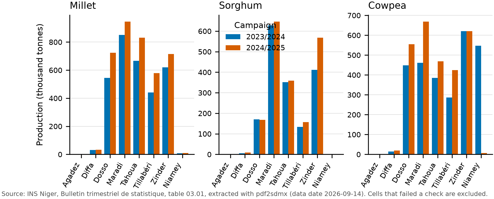

# pdf2sdmx

Turn a table printed in an INS Niger PDF report into validated observations in SDMX-CSV
and SDMX-ML. Three open source extraction stages run in order, the one with the fewest
failed arithmetic checks wins, its broken rows are repaired from the others when that
lowers the failure count, and every observation records which stage it came from.

**Question this answers:** can the detail that INS Niger publishes only as PDF (regional,
by crop, by campaign) be turned into machine readable, standard formatted data with a
measured error rate, so that someone maintaining a data portal can load it instead of
retyping it?

## Headline numbers

Measured on table 03.01 of the INS quarterly bulletin, 3rd quarter 2025 (campagne
agricole 2024/2025), against 94 cells transcribed by hand from the page image.

| | |
|---|---|
| Cells recovered exactly, stage 1 (pdfplumber) alone | 84 / 94 (89.4%) |
| Cells recovered exactly, full cascade | 94 / 94 (100%) |
| Wrong values that reached the output | 0 |
| How the cascade got the last 10 | pdfplumber glued the three Poivron rows into one. Camelot ml read that block correctly but broke 30 other cells. The cascade kept pdfplumber and took only the Poivron rows from Camelot, because each swap lowered the number of failed checks. Every observation carries the stage it came from (816 pdfplumber, 13 camelot_ml). |
| Extraction errors intercepted by the checks | 8 unreadable cells on that page before repair, 0 after, 0 silent |
| Source errors surfaced by comparing editions | 32 cross-campaign jumps above a factor of 5 listed in `data/processed/to_review.csv`, including Niamey cowpea area printed as 1 316 237 ha in the 1T 2024 bulletin (15 632 ha a year later) |
| Pages processed so far | 2 bulletins (1T 2024, 3T 2025), same table, identical layout 18 months apart |

The 100% is on one page of one table type and should be read as "the cascade and the
checks work on this layout", not as a general accuracy figure. The number that matters
more is the zero: no wrong value reached the output on either page, because every
unreadable cell was refused and listed rather than passed through.



## What comes out

For one page: the table as printed, which stage resolved it, the check results, and five
files.

| File | Content |
|---|---|
| `*_long.csv` | one observation per row: `REF_AREA, INDICATOR, TIME_PERIOD, OBS_VALUE, UNIT_MEASURE, OBS_STATUS, EXTRACTION_METHOD, SOURCE` plus the printed labels |
| `*_sdmx.csv` | SDMX-CSV 2.0 |
| `*_structure.xml` | SDMX-ML 2.1 structure message: DSD and dataflow `INS_NE:DF_PDF2SDMX(1.0)` |
| `*_data.xml` | SDMX-ML 2.1 data message |
| `*_to_review.csv` | every cell that failed a check, with the reason |

Region codes follow ISO 3166-2:NE. `OBS_STATUS` is `A` for a value that passed every
check and `E` for a value that failed one. Nothing is dropped silently.

## Run it

```bash
git clone <repo> && cd 09-ins-niger-sdmx
uv venv && source .venv/bin/activate
make install          # stage 1 only, fast
make install-ml       # adds Camelot ml with CPU torch, about 400 MB
python app.py         # UI and API on http://localhost:7860, docs at /docs
```

Or `docker compose up`. Sample PDFs: `python -m pdf2sdmx.core.ingest.refresh` downloads
the two bulletins listed in `data/sources.csv`, extracts the listed pages and writes
`data/processed/observations.csv` with a `DATA_DATE` column.

API: `GET /health`, `GET /metadata`, `POST /extract` (multipart PDF + page), `GET /metrics`.

## Measure it yourself

```bash
make evaluate     # compares each truth/*.csv with stage 1 alone and with the cascade
make figures      # figures/production_by_region.{pdf,png}
make test
```

Add a page: transcribe 10 to 30 cells into `truth/<pdf stem>_p<page>_truth.csv`
(format in `truth/README.md`) and run `make evaluate` again.

## Limits

- Two documents, one table type, one country. The layout logic (nested row labels,
  regions in columns, a total column named ENSEMBLE) was written against the INS
  quarterly bulletin. Other publications will need their own mapping rows and possibly
  new checks.
- The DSD is built by the tool. No official INS Niger DSD was found; when one exists the
  codes in `mapping/labels_to_codes.csv` should be replaced by it.
- Stage 3 (Docling, vision) is wired but not installed in the Space. The two sample
  bulletins have a text layer, so it was never needed. Scanned reports would need it.
- Camelot ml downloads two Table Transformer models (about 230 MB) at Space start-up.
  Stage 2 takes about 15 s per page on CPU; stage 1 takes 2 s.
- Row repair only swaps a row when the donor agrees on every cell the winner already read
  and the page-level failure count does not rise. It cannot fix a row both stages misread.
- Ground truth was transcribed from the rendered page image by the author of this
  repository, not by INS. It should be re-checked by a second person.
- The cross-edition jump check cannot say which edition is wrong. It lists both.
- No update is guaranteed. The refresh job runs quarterly and only downloads PDFs already
  listed in `data/sources.csv`; someone has to add new bulletins to that list.

## What is and is not new here

SDMX, ODP, pdfplumber, Camelot, Table Transformer, Docling and sdmx1 all exist and are
credited in `ARCHITECTURE.md`. A multi-agent architecture for SDMX compliance starting
from Excel sources was proposed at IAOS 2026. This repository works one step upstream,
on the PDF publications that are the actual form of diffusion for many national
statistics institutes, and reports a measured error rate on real pages. The mapping file
between INS labels and codes is the part that cannot be downloaded from anywhere.

## Layout

```
app.py                     Space entry point, mounts the Gradio UI on the FastAPI app
src/pdf2sdmx/core/         ingest (three stages + cascade), numbers, table, quality,
                           validate, reshape, sdmx_out, pipeline
src/pdf2sdmx/api/          FastAPI routes and schemas
src/pdf2sdmx/ui/           Gradio front end
mapping/labels_to_codes.csv
truth/                     hand-typed ground truth
data/sources.csv           PDFs and pages the refresh processes
data/raw/                  PDFs, never edited (gitignored)
data/processed/            observations.csv, to_review.csv, metrics.json
scripts/evaluate.py        accuracy against truth
scripts/make_figures.py
ARCHITECTURE.md            stages, thresholds, tool choices, deviations
BRIEF.md                   the project brief this was built from
```

Licence: MIT for the code. The PDFs belong to INS Niger; the extracted observations
are published under the same CC-BY 4.0 terms as the INS open data portal.
